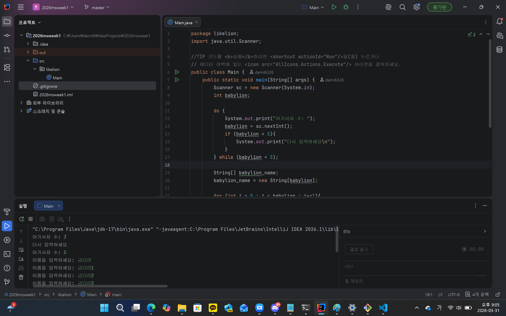
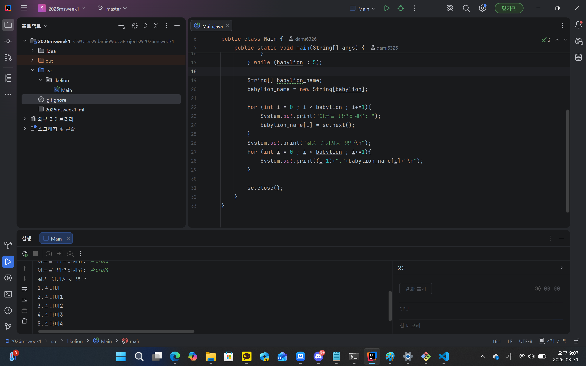

### 1. 오늘 배운 내용 
- 사용자 입력을 받는 방법(Scanner)
- 자바에서의 for/while문
- String[] 배열(문자열은 배열에 저장할땐 이걸 써야 함!)
- String[] 배열과, char[] 배열의 차이(char[] 배열은 한 글자씩만 저장 가능. String[] 배열은 문자열 저장 가능.)
- 자바에선 int+문자열을 출력할 수 있음!(파이썬에선 str로 바꿔서 해야 함)
### 2. 핵심 정리
- Scanner sc = new Scanner(System.in); sc는 객체. sc에 스캐너 명령어를 집어 넣음으로서 sc를 활용해 쉽게 값을 입력받을 수 있다.
- 문자열을 배열 하나하나에 놓고 싶을때는 String[] 을 쓰자!
### 3. 결과 이미지

### 4. 느낀점
내가 직접 생각하며 코드를 짜고, 잘 모르는 부분이 나올때마다 직접 찾아보며 진행했더니 약간은 자바 문법과 가까워 진 느낌이 든다.
파이썬이나 C언어와 자바의 차이점이나 유사한 점을 생각하며 하니 문법에 대해 좀 더 잘 이해할 수 있었다.
비록 아직 실력이 부족하여 배운 내용대로 코드를 깔끔하게 짜는 것은 못했지만(상속이나 캡슐화...등등)...다음번엔 할 수 있었으면 좋겠다.
보너스 문제는 잘만 하면 될 것 같은데...나중에 해보는 걸로!