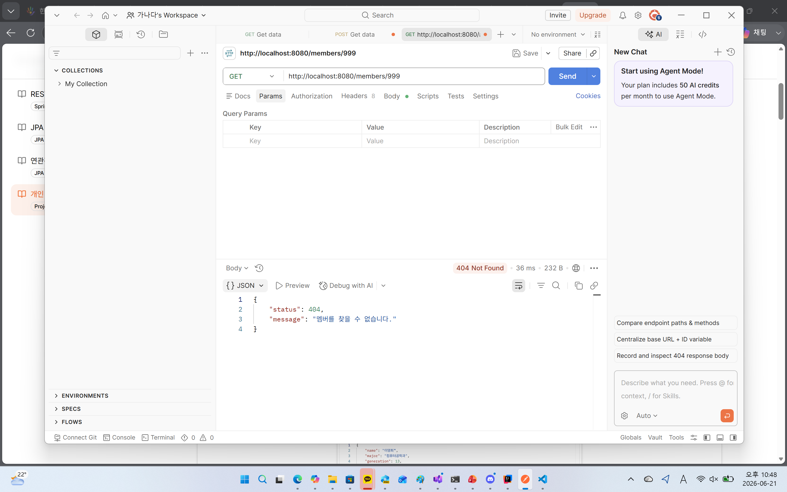
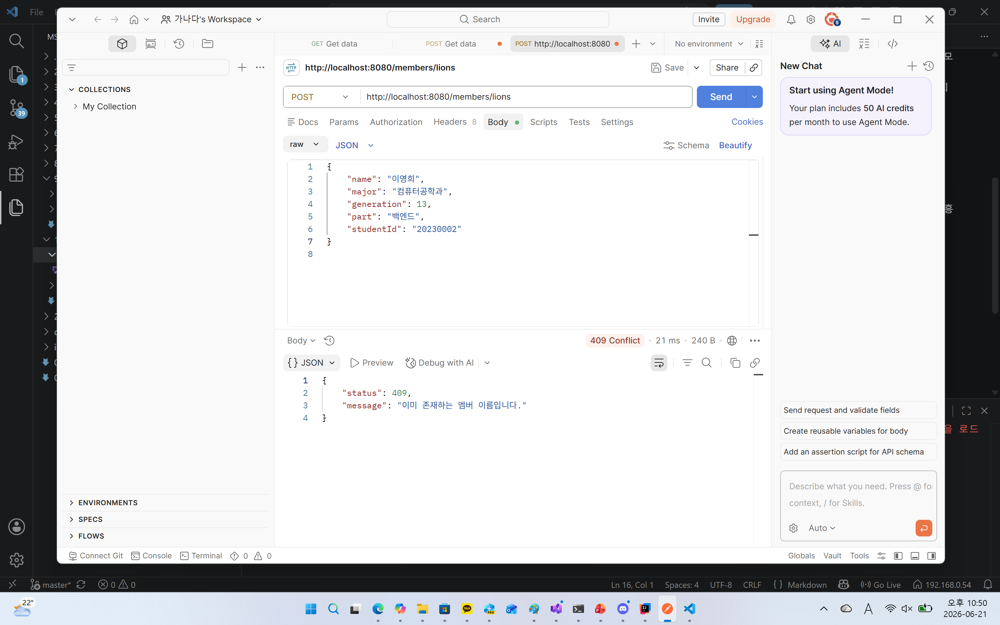
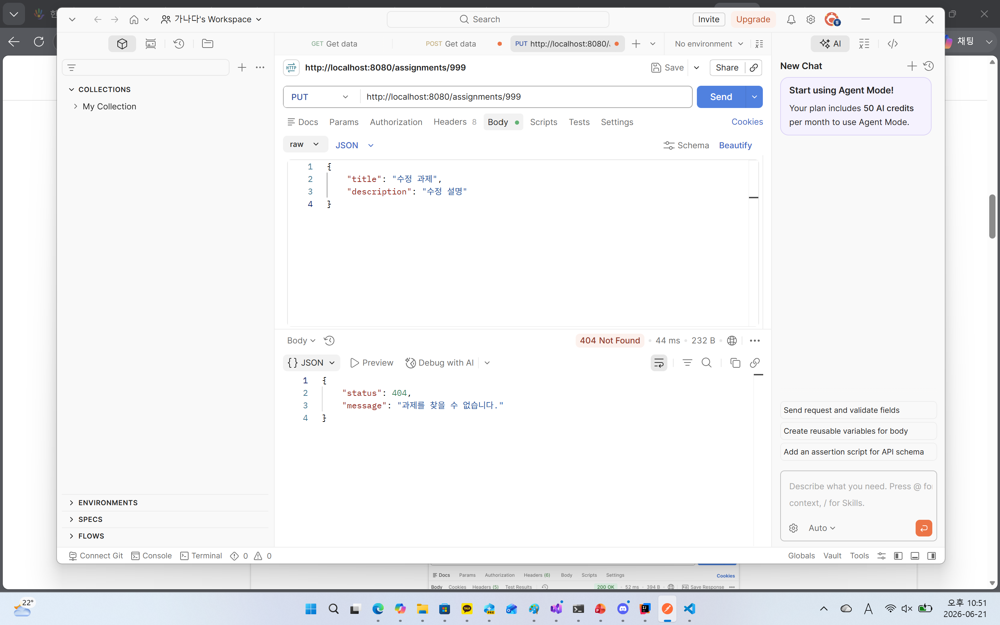
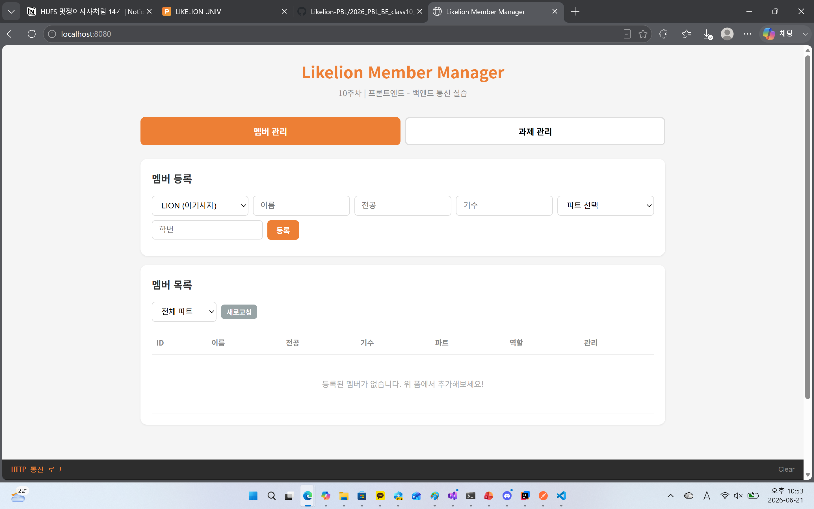

### 1. 오늘 배운 내용 
프론트엔드와 백엔드 간의 통신 방법
예외 처리와 검색 기능 구현

### 2. 핵심 정리
- @RestControllerAdvice - 애플리케이션 전체에서 발생하는 예외를 한 곳에서 처리할 수 있도록 도와주는 어노테이션. 여러 Controller에서 공통으로 사용하는 예외 처리 로직을 모아 관리할 수 있음
- @ExceptionHandler - 특정 예외가 발생했을 때 실행되는 메서드를 지정하는 어노테이션
- 커스텀 예외 - 프로젝트 상황에 맞는 의미 있는 예외를 직접 정의하는 클래스
- null 반환과 예외 처리의 차이
- null 반환 - 호출한 곳에서 직접 null 여부를 확인해야 함
- 예외 처리 - 문제가 발생했음을 명확하게 알리고 전역 예외 처리와 연계 가능
- Spring Data JPA 쿼리 메서드 - 메서드 이름만으로 검색 쿼리를 자동 생성하는 기능
- fetch() - 프론트엔드에서 백엔드 API를 호출하는 JavaScript 함수. 서버에 요청을 보내고 JSON 데이터를 받아 처리할 수 있음
- JSON 응답 처리 흐름 - fetch() 요청 -> 백엔드 API 호출 -> JSON 데이터 응답 -> JavaScript에서 데이터 파싱 -> HTML 화면에 렌더링
### 3. 결과 이미지

### 4. 느낀점
예전에는 예외가 발생하면 단순히 null을 반환하거나 오류 메시지만 출력했는데, 이번 학습을 통해 예외를 체계적으로 관리하는 방법을 알게 되었다.
@RestControllerAdvice를 사용하면 여러 컨트롤러에서 발생하는 예외를 한 곳에서 처리할 수 있어 코드가 훨씬 깔끔해진다는 점이 인상적이었다.
프론트엔드와 백엔드가 어떻게 연결되는 지를 직접 시도해 보며 이해 할 수 있었다.
