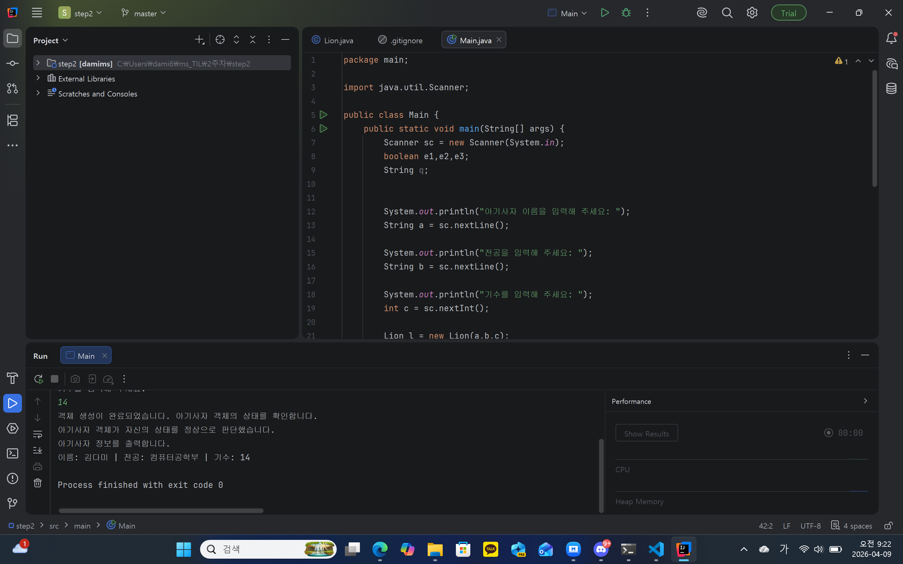
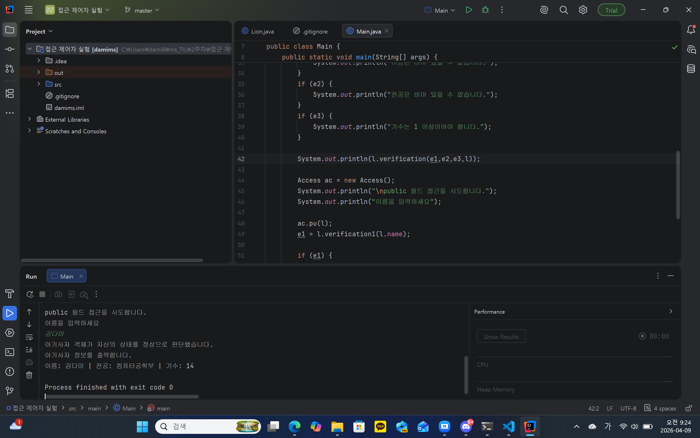
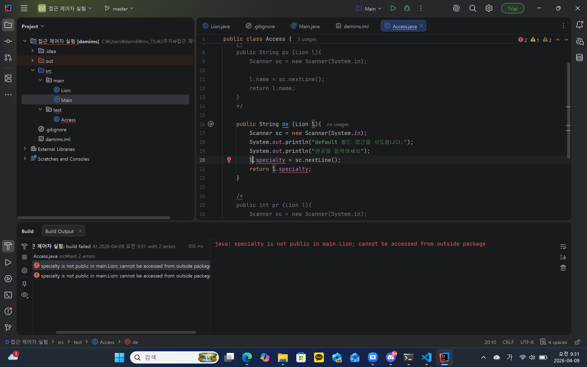
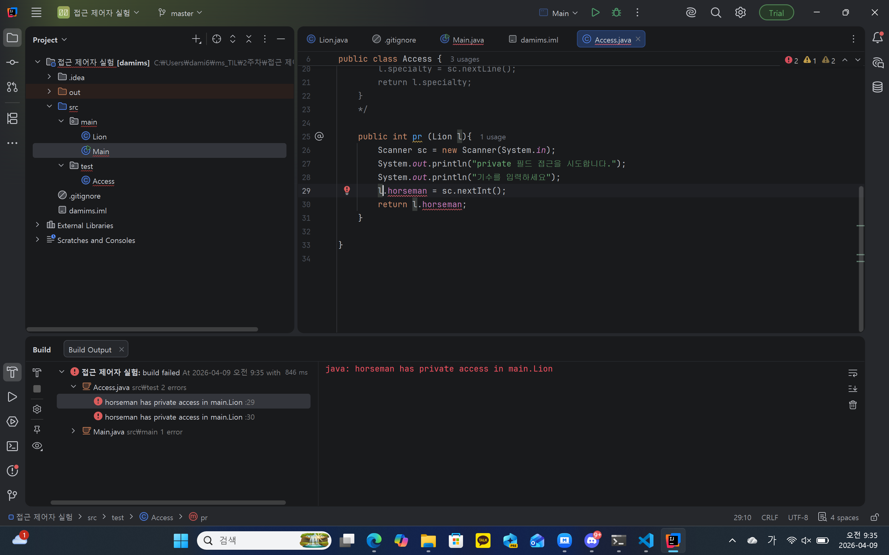

### 1. 오늘 배운 내용 
- 클래스와 메서드
- 변수로 정의하는 것과 객체로 정의하는 것의 차이점
- 접근 제어자 각각의 뜻과 사용법
### 2. 핵심 정리
- 패키지는 폴더, 클래스는 파일, 메서드는 함수!
- 변수는 따로따로 저장되지만 객체는 한 묶음으로 저장하기 때문에 가독성과 유지보수가 훨씬 쉬워질 것이라 예상...
- public: 모든 패키지, 모든 클래스에서 접근 가능.
- default: 아무것도 안쓴 기본 값. 같은 패키지 내에서 접근 가능.
- private: 같은 클래스 내에서 접근 가능. 다른 클래스에서 접근하려면 우회 방법을 써야 함.
### 3. 결과 이미지
step1 
step2 
접근 제어자 실험-1 
접근 제어자 실험-2 
접근 제어자 실험-3 
### 4. 느낀점
원래 패키지, 클래스, 메서드 다루는게 힘들었는데 이번 활동으로 인해 좀 감이 잡힌 것 같아 기분이 좋다.
step1,step2를 하며 캡슐화를 약간 해봤었는데, 덕분에 캡슐화가 뭔지 잘 알 수 있었다.
또, 접근 제어자는 주의해야 한다는 점을 알 수 있었다. 
확실히 이런 것들을 다룰 수 있게 되니 훨씬 재미있다.