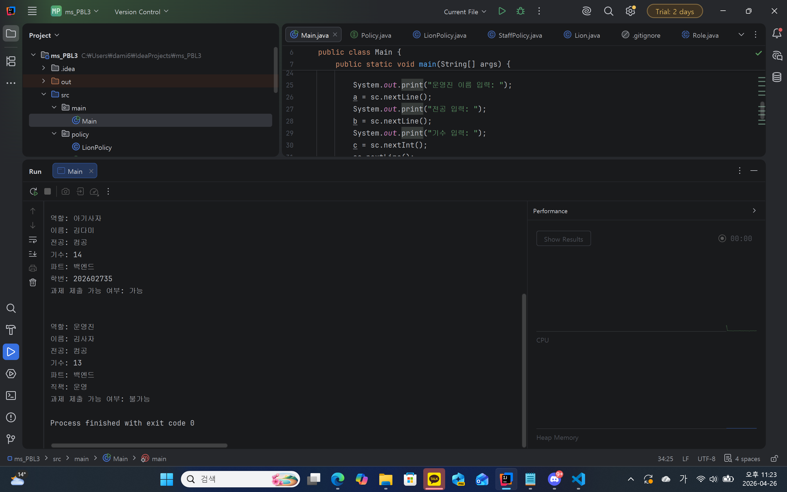

### 1. 오늘 배운 내용 
- 추상 클래스
- 상속
- 인터페이스
### 2. 핵심 정리
- 공통되는 부분은 추상 클래스로 정리하여 중복되는 부분이 없게 만든다.
- 일르 상속으로 할 수 있다.
- 인터페이스에 판단 로직을!
- 프로그래밍이란 그저 기능을 구현하는 것이 아닌 코드를 좀 더 활용하기 쉽게, 효율적으로 기능을 구현하도록 하는 것!
### 3. 결과 이미지

### 4. 느낀점
급하게 해서 그런지 왜 이 기능을 구현하는 데에 판단 로직이 들어가야 하는지 모르겠다. 아기사자와 운영진을 구분하는 게 아닌 그저 순서대로 입력하는 것 뿐이니까...그냥 판단 안하고도 충분히 가능한 부분이 아닐까? 라는 생각이 좀 들었다... 아마 혼자서 좀 더 봐야 할 것 같다. 다만 프로그래밍이 그저 기능만을 구현하기 위한 과정이 아니라는 점을 잘 알게 된 것 같다. 기능만을 구현하기 위함이면 이런 개념들이 필요하지 않을테니까... 