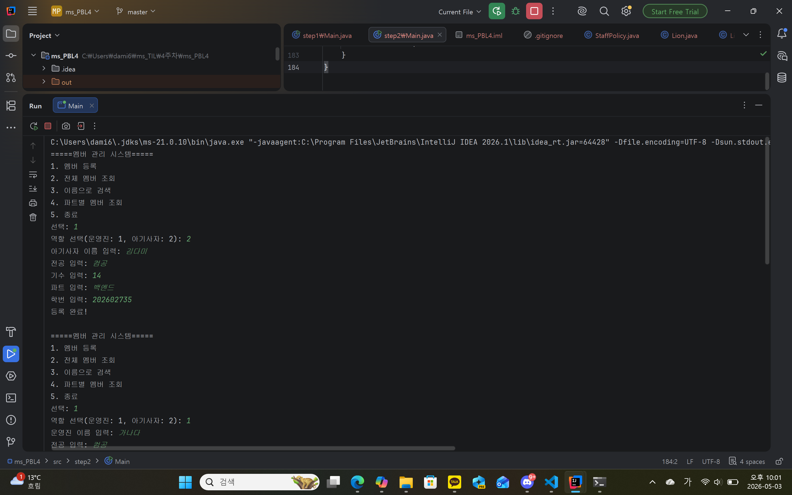
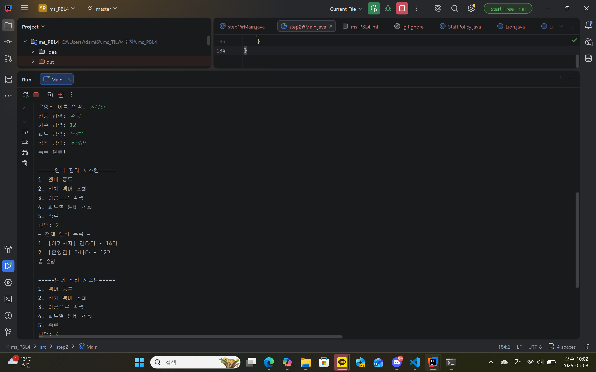
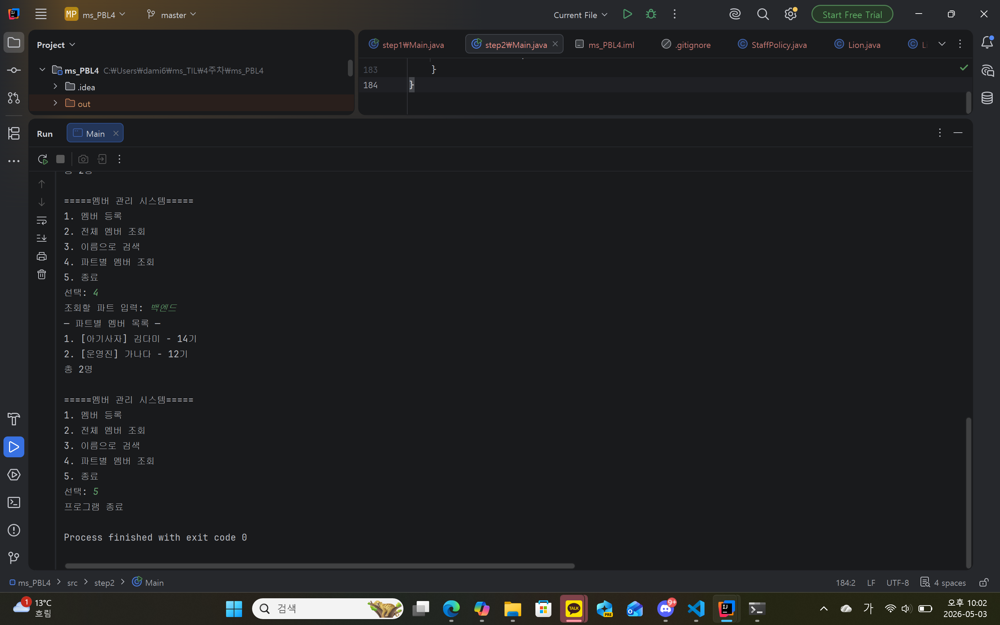

### 1. 오늘 배운 내용 
- list 사용법
- list와 관련된 여러 메서드 사용법

### 2. 핵심 정리
- list는 배열과는 다르게 객체만 저장 가능하지만, 크기를 사용하며 늘릴 수 있어서 편리하다.
- 즉, 매우 간단한걸 하는게 아닌 이상 list를 사용하자!
### 3. 결과 이미지

### 4. 느낀점
파이썬을 배울때 사용했던 리스트가 나와서 매우 반갑기도 하고, 배열의 한계점을 극복한 무언가를 알게 되어 매우 좋았으나, 리스트의 사용법이 파이썬과는 매우 달라 어려웠다.
솔직히 이해 잘 못한 것 같은데 좀 더 연습 해 봐야 할 듯...