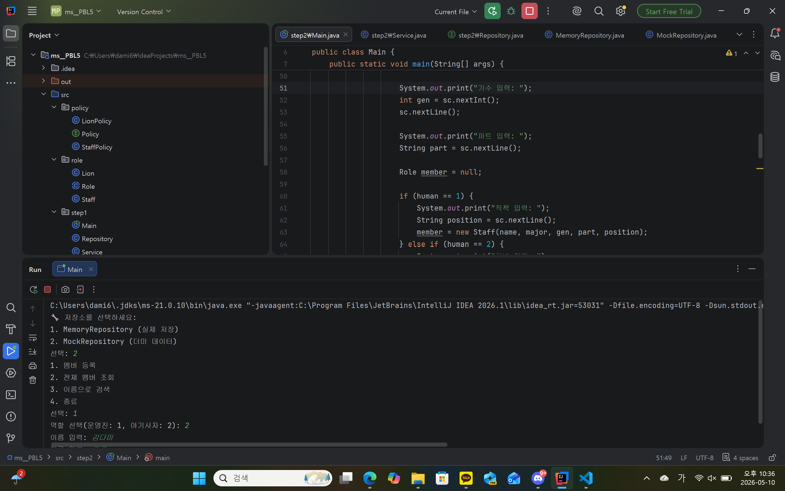

### 1. 오늘 배운 내용 
- 강한 결합과 약한 결합(의존성 주입)
### 2. 핵심 정리
- 강한 결합: 객체를 직접 생성
- 약한 결합: 외부에서 받아옴
- 강한 결합은 변경이 어렵고 확장이 불가함
- 의존성 주입은 확장이 가능
### 3. 결과 이미지

### 4. 느낀점
아직 강한 결합과 약한 결합의 장단점이 직접적으로 와 닿지는 않지만, 나중에 더 많이 써보다 보면 이해되지 않을까?