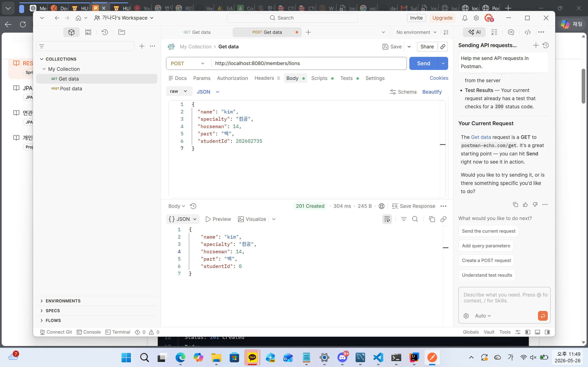
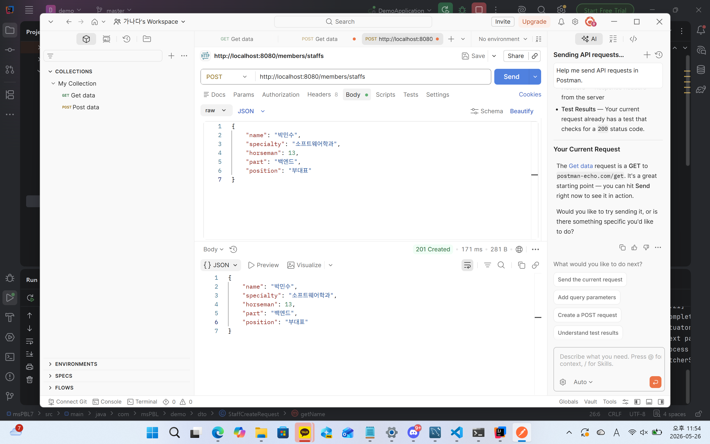

### 1. 오늘 배운 내용 
- DTO 분리
- REST API 설계 원칙
### 2. 핵심 정리
- DTO -> 데이터를 전달하기 위한 객체
- Spring에서는 JSON 요청 데이터를 DTO로 변환해 Controller에서 사용
- REST API 설계 원칙 - 자원(Resource)을 URI로 표현하고, HTTP 메서드로 행위를 구분하여 설계하는 방식
- GET - 데이터 조회
- POST - 데이터 생성
- PUT - 데이터 전체 수정
- PATCH - 데이터 일부 수정
- DELETE - 데이터 삭제
- 200 - 요청 성공
- 201 - 생성 성공
- 400 - 잘못된 요청
- 404 - 데이터 없음
- 500 - 서버 오류
- @PathVariable - URL 경로의 값을 받아온다.
- @RequestBody - 요청 본문(JSON)을 객체로 변환한다.
- DTO - 계층 간 데이터를 전달하기 위한 객체
- DTO는 엔티티 노출을 막고 필요한 데이터만 전달하기 위해 사용
- 역할별로 DTO를 분리하는 이유 - 생성할 때 필요한 데이터와 조회할 때 필요한 데이터가 다르기 때문
### 3. 결과 이미지

### 4. 느낀점
postman이 갑자기 나와서 좀 당황하긴 했는데...나름 재미있었다.
DTO 분리는 좀 더 연습해 보고 싶음!
미니 프로젝트를 하고 나니까 HTTP 메서드, HTTP 상태 코드의 의미를 다시 한번 볼 수 있어 뭔가 반가웠다.
또한 404같은 상태 코드는 코딩을 배울때 뿐만 아니라 평소에도 종종 봤던 코드인데, 이렇게 보니까 상당히 반가웠다.