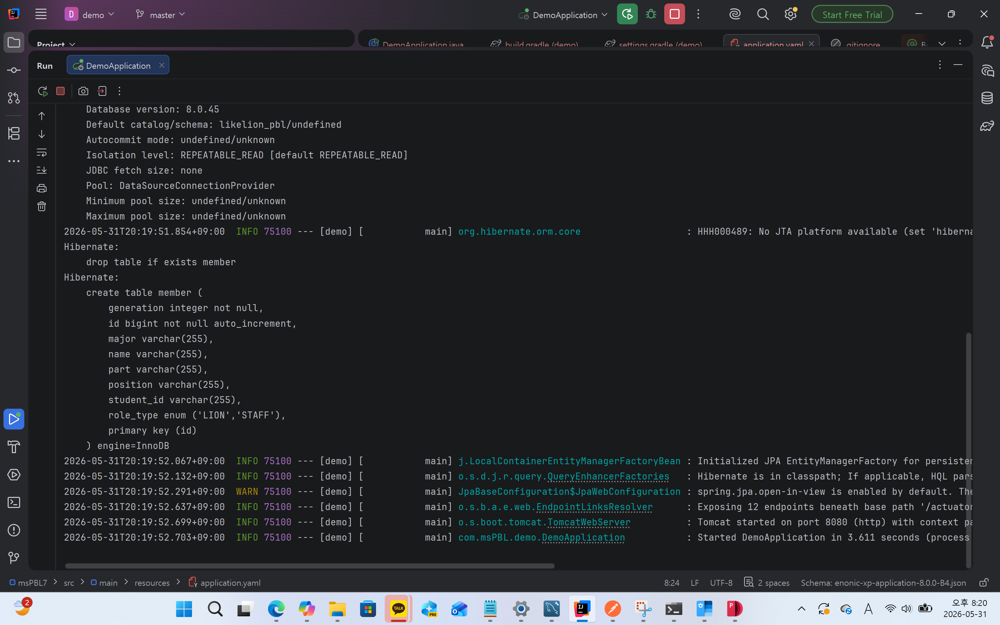
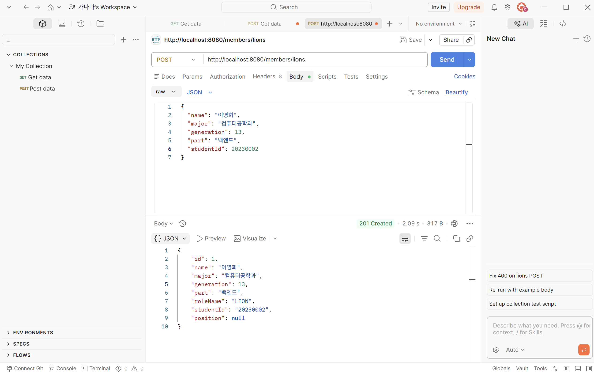
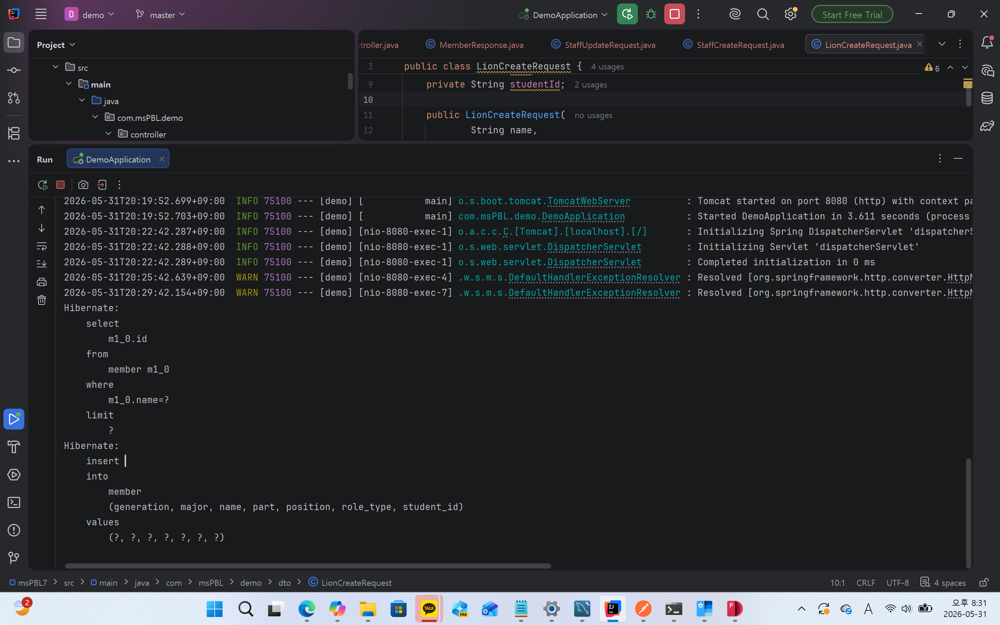
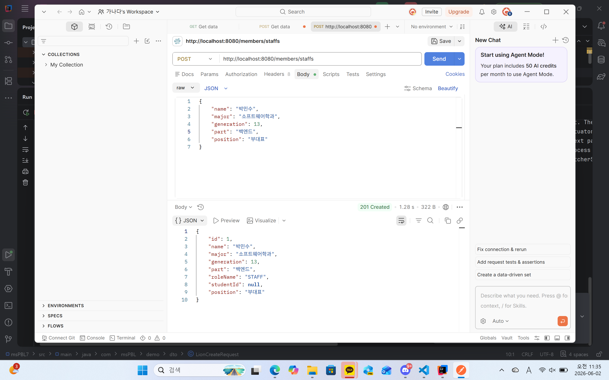
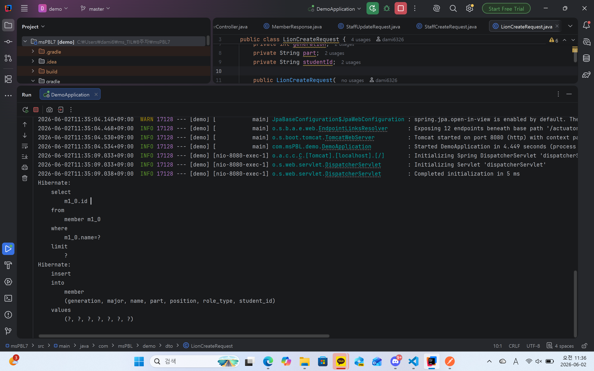
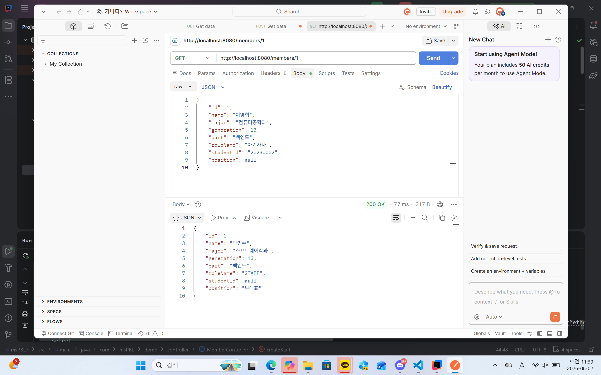
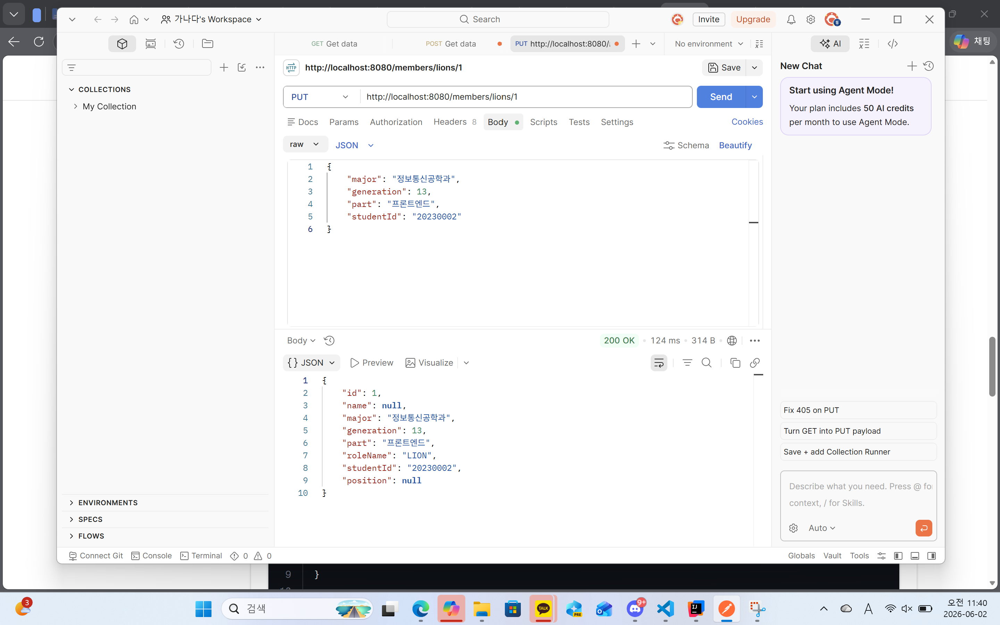

### 1. 오늘 배운 내용 
- 데이터베이스 도입
- 메모리 저장소를 MySQL로 전환
### 2. 핵심 정리
- 사용한 DB -> MySQL
- @Entity - 이 객체를 데이터베이스에 저장할 거라고 JPA에게 알려주는 표시
- @Id - 데이터를 구별하기 위한 고유의 키. 다른건 중복이 있어도 이거만큼은 중복이 없음.
- @GeneratedValue(strategy = IDENTITY) - id를 자동으로 1씩 증가시킴
- JpaRepository를 상속하면 데이터를 저장, 조회, 수정, 삭제하는 기본 CRUD 메서드들을 직접 작성하지 않아도 자동으로 사용할 수 있음.
- Spring Data JPA는 메서드 이름을 분석해서 자동으로 SQL 쿼리를 생성함
- Optional<Member> findByName(String name);
- findByStudentId(String studentId) 이런 것들...
- 규칙 - findBy + 엔티티 필드명
- 영속성 컨텍스트 - DB와 자바 객체 사이에서 객체를 관리하는 임시 저장소
- save() 호출 시 id가 채워지는 이유 - 생성된 id를 DB에서 받아 엔티티 객체에 자동으로 넣어 주기 때문에 id가 채워짐
- 
### 3. 결과 이미지

### 4. 느낀점
확실히 미니 프로젝트에서 한번 굴러보니까 더 이해가 잘 되는 느낌이었다. 또한 파일들을 DB로 변환하며 파일의 개수가 줄어들고, 코드가 변화하는 과정이 흥미로웠다.