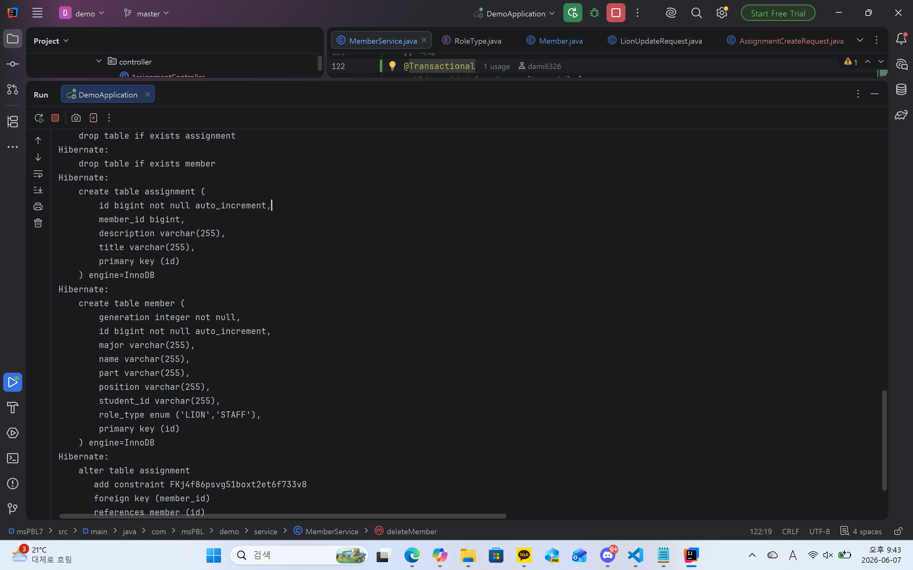
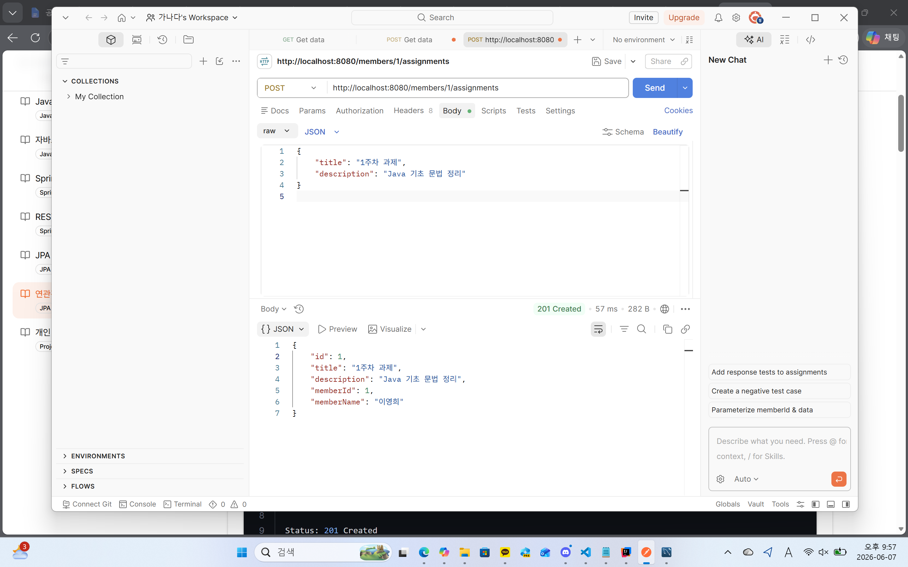
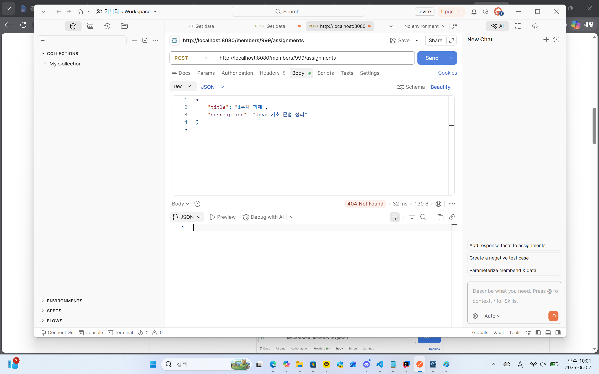
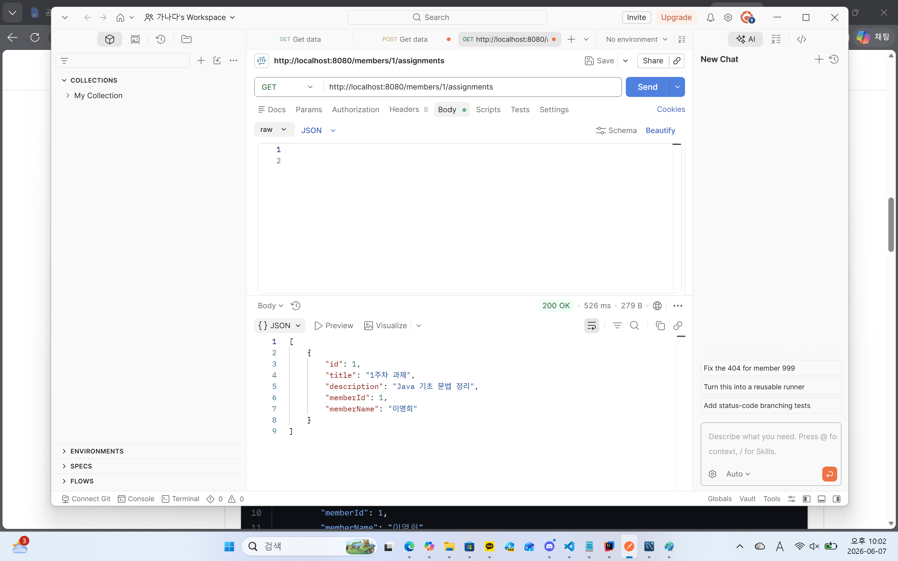
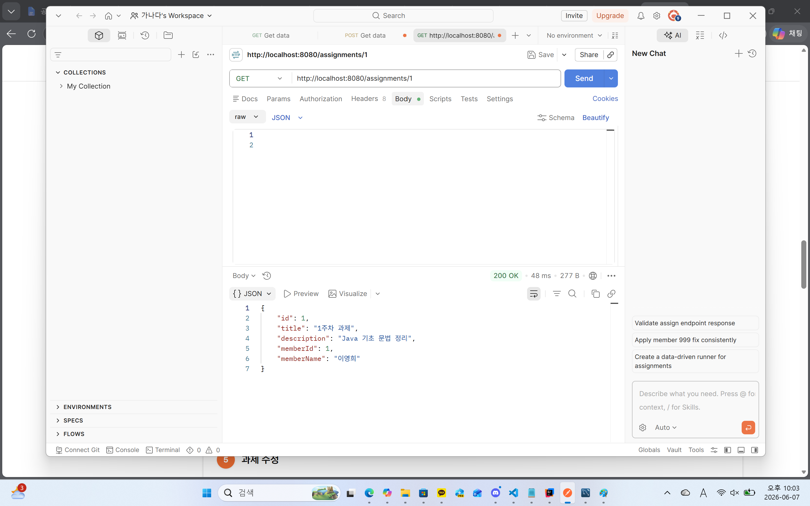
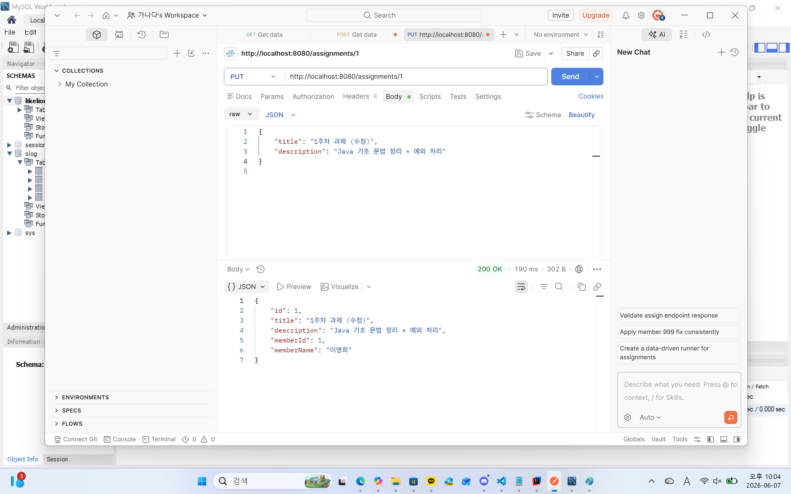
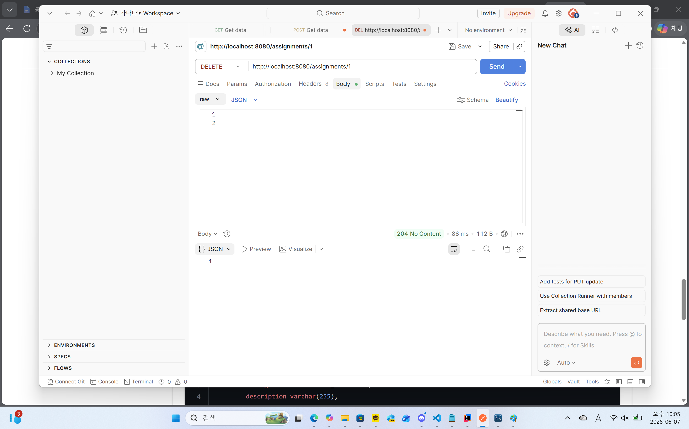
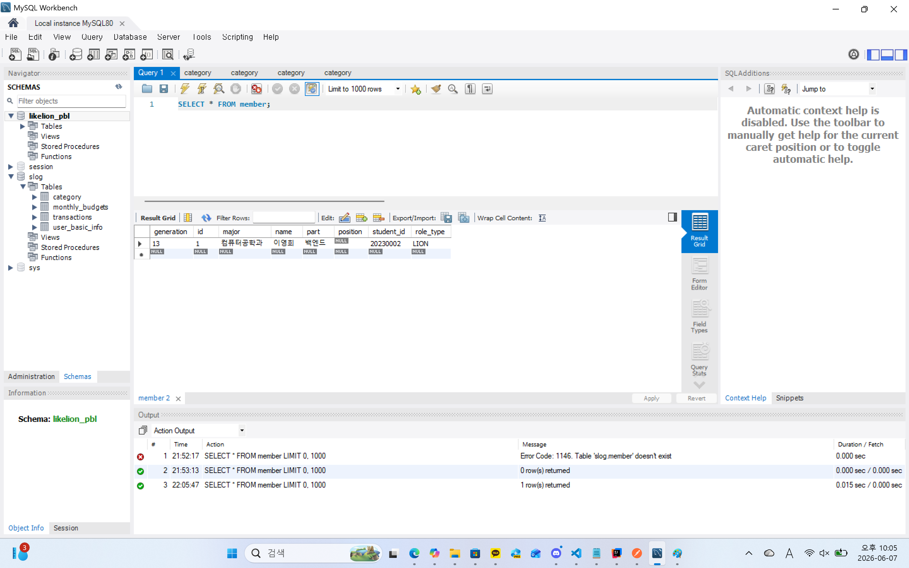

### 1. 오늘 배운 내용 
새로운 엔티티 만들어서 기존 데이터랑 연결!

### 2. 핵심 정리
- @ManyToOne - 여러 엔티티가 하나의 엔티티를 참조하는 관계. 외래키를 가지고 관계를 관리하는 주인
- @OneToMany - 하나의 엔티티가 여러 엔티티를 참조하는 관계 보통 mappedBy를 사용해 반대쪽 관계를 조회함
- 연관관계의 주인 - JPA에서 외래키를 관리하는 객체로, 연관관계의 변경 사항을 데이터베이스에 반영하는 쪽이다.
- mappedBy - 연관관계의 주인이 아닌 쪽에서 사용하는 속성. 이 관계는 상대 엔티티의 특정 필드가 관리하고 있음을 말함
- @JoinColumn - 연관관계를 맺을 때 사용할 외래키 컬럼을 지정하는 어노테이션
- 외래키 - 한 테이블이 다른 테이블의 데이터를 참조하기 위해 저장하는 컬럼
- @Transactional - 여러 DB 작업을 하나의 트랜잭션으로 묶어 모두 성공하면 반영하고, 중간에 실패하면 모두 롤백하는 기능
- @Transactional(readOnly = true) - 이 메서드는 데이터를 조회만 하고 수정하지 않음.
- 

### 3. 결과 이미지

### 4. 느낀점
여러개의 데이터가 연결 될 수 있고, 1:N 관계가 형성된다는 부분이 흥미로웠다.
객체 간의 관계를 JPA 어노테이션으로 표현하면 데이터베이스에서는 외래키로 관리된다는 점이 인상적이었다.
